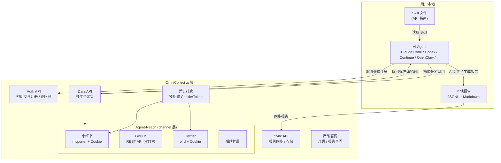
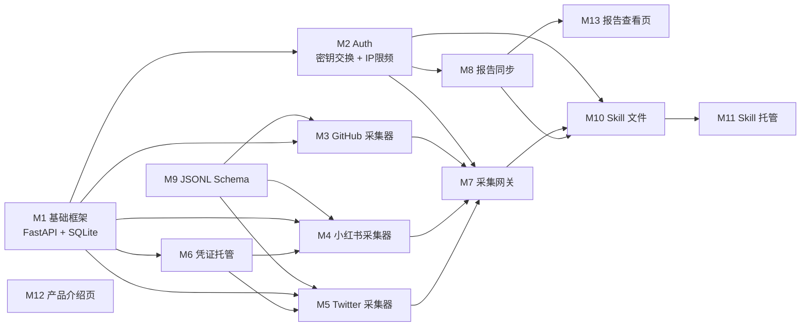

# OmniCollect — 多平台情报采集与智能分析系统

## 架构文档 v0.2

---

## 1. 系统定位

OmniCollect 是一个**数据 API 平台 + Skill 指南**的组合产品。

- **平台（云端）**：提供多平台数据采集 API、用户认证、报告同步
- **Skill（本地）**：一份 API 指南文档，教任何 AI agent 如何调用平台接口
- **AI 分析（本地）**：由用户自己的模型完成，平台不参与推理



---

## 2. 核心流程

### 2.1 安装与注册流程

```
用户 → 访问官网 → 复制 Skill 安装 URL
     → 粘贴给本地 AI Agent
     → Agent 通过 HTTP GET 下载 Skill 文件（API 指南）
     → Skill 指引 AI 执行注册流程：
       1. AI 在本地用加密算法生成一对密钥 (secret_key)
       2. AI 调用 POST /api/v1/auth/register 将公钥发送到云端
          （云端校验 IP，同一 IP 最多注册 3 个账号）
       3. 云端返回确认，双方各持密钥（双向通行证）
       4. AI 将密钥写入 Skill 目录下的约定位置
          例如: <skill_dir>/.credentials/secret.key
     → 安装完成，后续请求自动携带密钥认证
```

> **密钥持久化策略**：直接写入 Skill 安装目录下的固定路径。Skill 文件中预先约定好目录位置，AI 生成密钥后写入即可。无需额外的 `~/.config` 目录，最简单直接。

### 2.2 数据采集流程

```
用户: /collect "AI Agent 框架"
           │
           ▼
    AI Agent 读取 Skill
    ─ 解析用户意图，确定目标平台
           │
           ▼
    携带密钥调用 OmniCollect Data API
    ─ POST /api/v1/collect
    ─ Headers: X-Secret-Key: <secret_key>
           │
           ▼
    云端 Agent-Reach 并发采集各平台数据
    ─ 小红书: mcporter + 预配置 Cookie
    ─ GitHub: gh CLI
    ─ Twitter: bird + Cookie
           │
           ▼
    返回标准化 JSONL 数据给 Agent
           │
           ▼
    AI Agent 本地分析（用户自己的模型）
    ─ 跨平台信息合并、去重
    ─ 趋势判断（萌芽/爆发/成熟/衰退）
    ─ 生成 Markdown 综合报告
           │
           ▼
    本地保存 JSONL + MD 报告
           │
           ▼
    调用 Sync API 同步报告到云端
    ─ POST /api/v1/reports/sync
```

---

## 3. 模块划分

### 3.1 技术选型

| 项目 | 选择 | 说明 |
|------|------|------|
| **运行时** | Python + FastAPI | 轻量异步框架，自带 Swagger API 文档 |
| **数据库** | SQLite | 轻量，零运维，单文件 |
| **数据校验** | Pydantic | FastAPI 内置，直接对应 JSONL Schema |
| **页面模板** | Jinja2 | 官网静态页面渲染 |
| **数据采集** | Agent-Reach | Python 原生集成，直接 import |

### 3.2 云端后台

| 模块 | 职责 | 关键技术 |
|------|------|---------|
| **Auth 服务** | AI 注册（密钥交换）、签名验证中间件、IP 限频 | FastAPI Depends + Pydantic |
| **Data API** | 接收采集请求，调度 Agent-Reach channels | Agent-Reach + asyncio 并发 |
| **Sync API** | 接收本地报告，存储到云端 | SQLite + aiosqlite |
| **凭证托管** | 管理各平台预配置 Cookie/Token | 加密存储, 定期刷新 |
| **产品官网** | 产品介绍、安装引导、报告查看 | Jinja2 模板 |

### 3.3 Skill 文件（本地 API 指南）

Skill 文件是一份 Markdown 文档，内容包含：

```markdown
# OmniCollect Skill

## 首次使用 — 自动注册
- 检查 <skill_dir>/.credentials/secret.key 是否存在
- 若不存在：用加密算法生成密钥 → 调用注册 API → 写入密钥文件
- 若已存在：直接读取，后续请求携带

## API 参考
- POST /api/v1/auth/register — 注册（AI 调用，密钥交换）
- POST /api/v1/collect — 多平台数据采集
- POST /api/v1/reports/sync — 报告云端同步
- GET  /api/v1/reports — 查询历史报告

## 输出格式规范
- JSONL 标准字段定义
- Markdown 报告模板

## 分析指引
- 引导 AI Agent 如何做跨平台合并
- 趋势判断维度和标准
```

> **通用性**：Skill 本质只是 API 使用指南 + 本地密钥管理指令，任何能读 Markdown、发 HTTP 请求、写本地文件的 AI 客户端都能使用（Claude Code、Codex、Continue、OpenClaw 等）。

### 3.3 统一数据格式 (JSONL)

```jsonl
{"platform":"xiaohongshu","type":"post","id":"...","title":"...","content":"...","author":"...","likes":123,"comments":45,"timestamp":"2026-03-25T10:00:00Z","url":"..."}
{"platform":"github","type":"repo","id":"...","name":"...","description":"...","stars":1200,"forks":300,"language":"Python","last_updated":"...","url":"..."}
{"platform":"twitter","type":"tweet","id":"...","content":"...","author":"...","retweets":89,"likes":456,"timestamp":"...","url":"..."}
```

---

## 4. API 设计（初稿）

所有响应统一格式：

```json
{
  "code": 200,
  "message": "ok",
  "data": { ... }
}
```

常用状态码：

| HTTP Status | code | 含义 |
|-------------|------|------|
| 200 | 200 | 成功 |
| 400 | 400 | 请求参数错误 |
| 401 | 401 | 未认证 / 密钥无效 |
| 403 | 403 | 无权限（如未申请该平台权限） |
| 429 | 429 | IP 注册数超限 / 请求频率超限 |
| 500 | 500 | 服务端错误 |

### 4.1 注册（AI 调用）

```
POST /api/v1/auth/register

Body: {
  "public_key": "base64-encoded-key..."
}

--- 成功 201 ---
{
  "code": 201,
  "message": "registered",
  "data": {
    "agent_id": "ag_xxxx",
    "registered_at": "2026-03-25T10:00:00Z"
  }
}

--- 失败 429（同一 IP 超过 3 个账号）---
{
  "code": 429,
  "message": "ip registration limit exceeded (max 3)",
  "data": null
}
```

> **流程**：AI 本地生成密钥对 → 将公钥 POST 到此接口 → 云端存储并关联 IP → 返回 agent_id。后续请求用私钥签名，云端用公钥验证。

### 4.2 数据采集

```
POST /api/v1/collect
Headers: X-Agent-Id: ag_xxxx
         X-Signature: <request-body-signature>

Body: {
  "topic": "AI Agent 框架",
  "platforms": ["xiaohongshu", "github", "twitter"],
  "options": {
    "limit": 20,
    "time_range": "7d"
  }
}

--- 成功 200 ---
{
  "code": 200,
  "message": "ok",
  "data": {
    "request_id": "req_xxxx",
    "results": [
      {"platform": "xiaohongshu", "status": "ok", "count": 15, "data": [...]},
      {"platform": "github", "status": "ok", "count": 20, "data": [...]},
      {"platform": "twitter", "status": "error", "error": "channel unavailable"}
    ]
  }
}

--- 失败 401 ---
{
  "code": 401,
  "message": "invalid signature",
  "data": null
}
```

### 4.3 报告同步

```
POST /api/v1/reports/sync
Headers: X-Agent-Id: ag_xxxx
         X-Signature: <request-body-signature>

Body: {
  "topic": "AI Agent 框架",
  "report_md": "# 情报报告\n...",
  "raw_data_jsonl": "...",
  "generated_at": "2026-03-25T12:00:00Z"
}

--- 成功 201 ---
{
  "code": 201,
  "message": "synced",
  "data": {
    "report_id": "rpt_xxxx",
    "url": "https://omni-collect.example.com/reports/rpt_xxxx"
  }
}
```

### 4.4 查询历史报告

```
GET /api/v1/reports
Headers: X-Agent-Id: ag_xxxx
         X-Signature: <query-string-signature>

--- 成功 200 ---
{
  "code": 200,
  "message": "ok",
  "data": {
    "reports": [
      {"report_id": "rpt_xxxx", "topic": "...", "generated_at": "...", "url": "..."}
    ]
  }
}
```

---

## 5. 模块拆分与分工（3 人）

按独立小模块拆分，每个模块可由一人用 AI coding 端到端完成。

### 模块清单

| # | 模块名 | 范围 | 交付物 | 依赖 |
|---|--------|------|--------|------|
| M1 | **数据库 & 基础框架** | FastAPI 项目脚手架、SQLite schema、Pydantic models、配置管理 | 可运行的空服务 + DB 初始化 | 无 |
| M2 | **Auth 模块** | AI 注册（密钥交换）、签名验证中间件、IP 限频 (3/IP) | 注册 endpoint + auth middleware | M1 |
| M3 | **GitHub 采集器** | 直接调 GitHub REST API (HTTP)，输出标准 JSONL | `/api/v1/collect/github` | M1 |
| M4 | **小红书采集器** | 调 Agent-Reach 小红书 channel + Cookie 托管 | `/api/v1/collect/xiaohongshu` | M1, M6 |
| M5 | **Twitter 采集器** | 调 Agent-Reach Twitter channel + Cookie 托管 | `/api/v1/collect/twitter` | M1, M6 |
| M6 | **凭证托管** | 平台 Cookie/Token 的加密存储、读取、刷新 | credential CRUD API + 刷新定时任务 | M1 |
| M7 | **采集网关** | `/api/v1/collect` 统一入口，并发调度 M3-M5，合并返回 | 1 个聚合 API endpoint | M2, M3, M4, M5 |
| M8 | **报告同步** | 接收本地报告并存储，支持查询历史报告 | `/api/v1/reports/sync` + `/api/v1/reports` | M2, M1 |
| M9 | **JSONL Schema** | 统一数据格式定义 + 校验逻辑 | JSON Schema 文件 + validate 工具函数 | 无 |
| M10 | **Skill 文件** | API 指南文档（密钥生成指引 + 注册流程 + API 参考 + 分析指引） | 一份 Markdown，可通过 URL 被 AI agent 下载 | M2, M7, M8 |
| M11 | **Skill 托管** | HTTP endpoint 提供 Skill 文件下载 | `GET /skill.md` | M10 |
| M12 | **官网 — 产品介绍页** | Landing page，产品介绍 + 安装命令复制 | 一个静态页面 | 无 |
| M13 | **官网 — 报告查看页** | 展示云端同步的历史报告 | 报告列表 + 详情页 | M8 |

### 依赖关系



### 建议排期（3 人并行）

**第一轮 — 地基（并行启动）**

| 人员 | 模块 | 说明 |
|------|------|------|
| 甲 | M1 基础框架 | 项目脚手架、DB、配置，其他人等这个先出 |
| 乙 | M9 JSONL Schema | 无依赖，定义好格式供采集器对齐 |
| 丙 | M12 产品介绍页 | 无依赖，官网先行 |

**第二轮 — 核心能力**

| 人员 | 模块 |
|------|------|
| 甲 | M2 Auth |
| 乙 | M3 GitHub 采集器 |
| 丙 | M6 凭证托管 |

**第三轮 — 扩展采集 + 页面**

| 人员 | 模块 |
|------|------|
| 甲 | M4 小红书采集器 |
| 乙 | M5 Twitter 采集器 |
| 丙 | M8 报告同步 |

**第四轮 — 聚合 + 交付**

| 人员 | 模块 |
|------|------|
| 甲 | M7 采集网关 |
| 乙 | M13 报告查看页 |
| 丙 | M10 Skill 文件 + M11 Skill 托管 |

---

## 6. 待定事项

- [x] 技术栈：Python + FastAPI + Pydantic + SQLite
- [x] 认证方案：AI 本地生成密钥，密钥交换注册，IP 限 3 个
- [x] 密钥持久化：写入 Skill 安装目录
- [ ] 部署方案（服务器 / 云服务）
- [ ] Agent-Reach 使用方式：直接依赖 pip 包 or fork 后定制？
- [ ] Cookie 刷新机制：小红书等平台 Cookie 过期后如何自动续期？
- [ ] 计费 / 配额：是否限制免费用户调用次数？
- [ ] 第一期支持平台范围确认（建议先 GitHub + 小红书 + Twitter）
- [ ] 密钥算法选择（如 Ed25519 / HMAC-SHA256 等）
